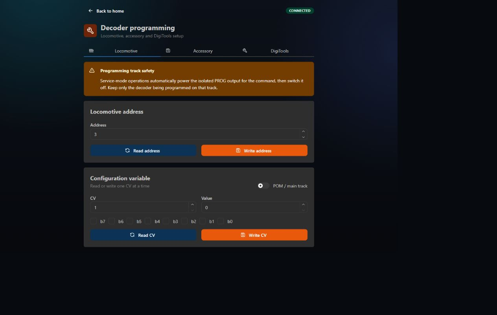

# Decoder programming

## Locomotive decoders

Service-mode commands use the isolated PROG output. Keep only the decoder being programmed on that track.

- Read or write locomotive address
- Read or write CV1–CV1024
- Edit CV values as decimal or individual bits
- POM/main-track CV write by locomotive address

POM generally cannot confirm the written result. Do not change a locomotive address with POM.

## Accessory decoders

Two methods are available:

- **CV programming** on the isolated PROG output
- **Address learning** on MAIN after pressing the decoder's learn/program button

Address learning sends direction 0 or 1 to a linear accessory address.

## DigiTools

DigiTools address setup does not use ordinary CV programming. Put the device into its programming mode first, then send the requested normal accessory direction on MAIN.

### DigiSwitch-8

- Short PRG press: assign K1–K4 or K5–K8 starting address.
- PRG held for more than three seconds: set timing for the selected output group.

### DigiSignal-X4YYY

- Assign A–B or C–D group starting address with direction 1 or 0.
- The signal element can then use the learned address as the start of its consecutive output range.

Always follow the decoder manufacturer's manual for the required button timing and address interpretation.

