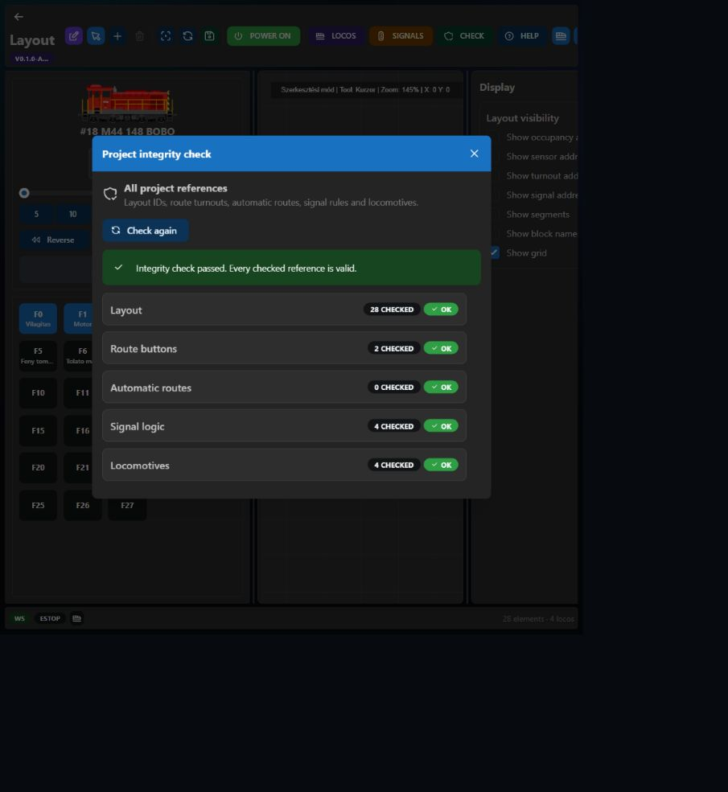

# Diagnostics and integrity

## Project integrity checker

The **CHECK** button validates the complete project, not only Signal Logic.

It checks:

- missing and duplicate layout element IDs;
- Route Button turnout IDs and element types;
- duplicate/missing route turnout assignments;
- Automatic Route block IDs;
- Signal Logic signal, turnout, and sensor IDs;
- locomotive IDs and duplicate DCC addresses;
- duplicate locomotive function numbers.

Signal rule saves are also independently validated by the firmware. Invalid IDs cannot be saved by bypassing the browser UI.

## Info panel

The runtime Info tab reports:

- DCC-EX version and hardware;
- track power and current readings;
- uptime, free heap, and minimum free heap;
- Core 0 web/Wi-Fi activity and Core 1 DCC-EX activity;
- ESP32 internal silicon temperature;
- WebSocket client, queue, and drop counters;
- reset reason;
- firmware, OTA, and LittleFS partition usage.

CPU percentages are activity estimates based on idle-loop sampling, not laboratory profiling.

## Temperature levels

| Internal chip temperature | Status |
| --- | --- |
| Below 65 °C | NORMAL |
| 65–74.9 °C | WARM |
| 75–85 °C | WARNING |
| Above 85 °C | CRITICAL |

Entering CRITICAL opens one acknowledgement dialog. It does not reopen for every telemetry frame; the alarm rearms after cooling below 80 °C. The reading is one shared silicon-temperature value, not a separate temperature for each CPU core and not room temperature.

## Devices tab

The Devices tab lists configured DCC-EX HAL devices, I²C addresses, GPIO/virtual-pin ranges, status, and a live I²C bus scan. An address-based type guess can be ambiguous.

## Log tab

The runtime Log tab displays live command and state traffic without requiring a USB serial monitor. Logging starts **Disabled** after every page load and does not collect messages until **Enabled** is selected.

Each entry shows time, direction (`TX`, `RX`, or `SYS`), message type, and payload. Client-local filters select:

- **Raw DCC-EX** — firmware `rawInfo`, acknowledgements, and direct DCC-EX commands/responses;
- **I/O** — locomotive, turnout, accessory, VPIN, sensor, block, and power commands/events;
- **Status polling** — frequent status and runtime telemetry, hidden by default;
- **Other WS** — remaining WebSocket messages, hidden by default.

The selected filters are saved in browser local storage. **Clear** removes the visible session buffer. At most 200 entries are retained; after that, the oldest entry is discarded for every new one, so logging cannot grow browser memory without limit.

Raw and telemetry delivery is diagnostic and may be dropped by the firmware when a WebSocket client is busy. Control commands and state synchronization retain priority.

## Console serial connection

The Console can use the normal WebSocket command channel without USB. Its optional direct USB serial connection uses the Web Serial API, which desktop Chromium exposes only in secure contexts. For the embedded HTTP interface, see the Chrome flag and safety note in [Installation and first start](Installation-and-First-Start#embedded-console-and-web-serial).
