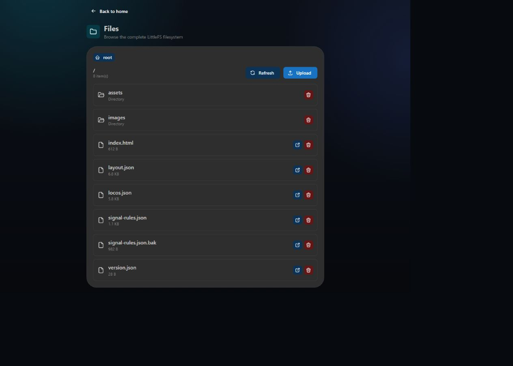

# Files, backup, and restore

## LittleFS file manager

The Files page starts at the LittleFS root and can traverse every directory. It supports:

- directory navigation;
- file upload to the current directory;
- deletion of files and empty directories;
- small image previews;
- safe text viewing for HTML, JavaScript, CSS, JSON, and other source files.

Deleting `layout.json`, `locos.json`, `signal-rules.json`, web assets, or images can make the UI or railway configuration incomplete. Export a backup first.

## Export

The release-independent JSON backup attempts to include every section it understands:

- layout;
- locomotives;
- locomotive images from `/images`;
- Signal Logic rules.

If one section cannot be read, the export saves the remaining sections and reports a warning. The container version is informational and is not tied to an application release.

Live block assignments and cached turnout states are stored separately in `/runtime-state.json` and are not part of the normal configuration export. They can be downloaded or uploaded manually with the Files page if preserving live runtime state is specifically required.

## Import

Import restores every known section present in the file and ignores unknown future sections. This makes backups portable across releases. After import:

1. reload the layout;
2. run the global integrity check;
3. verify turnout and signal addresses with track power off;
4. test physical outputs carefully.
