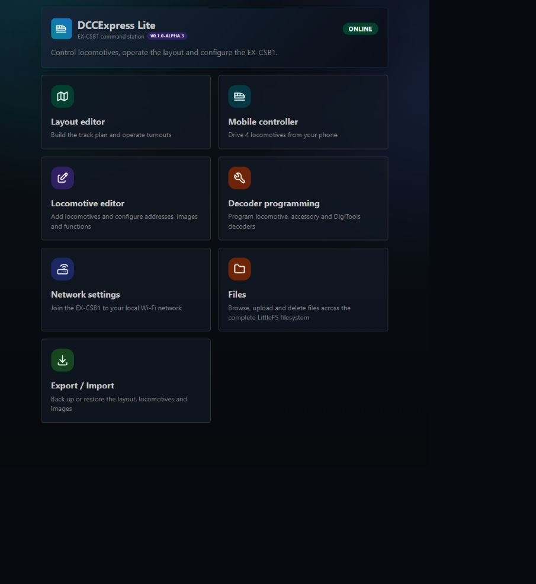

# DCCExpressLite

DCCExpressLite is a self-contained browser controller for the **EX-CSB1** command station. The ESP32 serves the application directly: no desktop program, Node.js server, cloud account, or internet connection is required while operating the railway.

## Start here

1. [Install and connect](Installation-and-First-Start)
2. [Create and operate a layout](Layout-Editor)
3. [Configure turnouts and routes](Turnouts-and-Routes)
4. [Configure signals and automation](Signals-and-Automation)
5. [Drive locomotives](Locomotives-and-Mobile-Control)
6. [Configure a gamepad](Gamepad-Control)
7. [Back up your data](Files-Backup-and-Restore)
8. [Configure external I²C devices](Device-Configuration)

## Main features

- Responsive desktop, tablet, and mobile UI
- Locomotive control, functions, direction inversion, images, and emergency stop
- Configurable Bluetooth/USB gamepad control with client-local mappings
- Visual layout editor with persistent client-side zoom and position
- Persistent block occupancy shared between connected clients
- Physical DCC accessory turnout control
- DCC accessory and DCC-EX VPIN output control with Toggle, Push, and Momentary buttons
- Basic route buttons and automatic block-to-block routes
- ID-based signal automation driven by turnouts and sensors
- Locomotive, accessory, and DigiTools decoder programming
- Root-based LittleFS file manager
- Release-independent export/import including locomotive images and signal rules
- WebSocket reconnect, multi-client support, diagnostics, and integrity checking
- Filterable live DCC-EX and I/O logging with bounded browser memory use
- Dynamic PCA9685, MCP23017, PCF8574, and PCF8575 configuration with live pin testing and input indication

Open the installed command center at `http://dccex.local` or at the numeric IP address shown on the EX-CSB1 display.

The **HELP** button in the Layout Editor always opens this Wiki.
