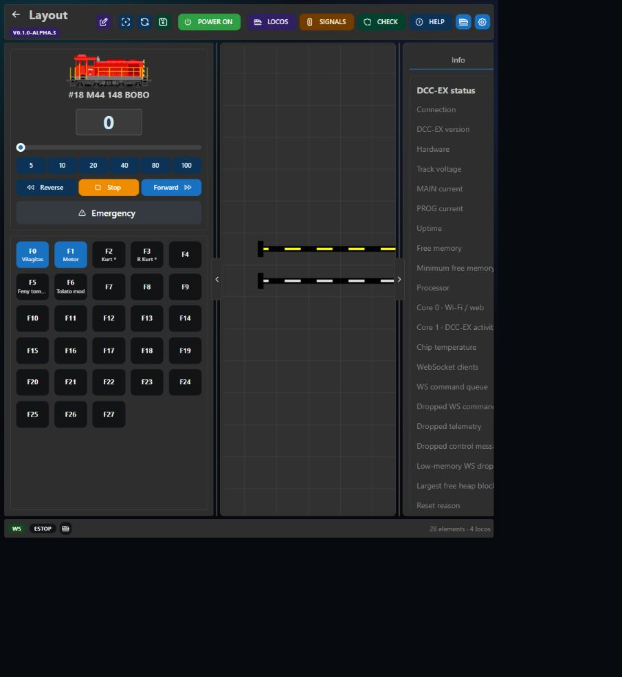
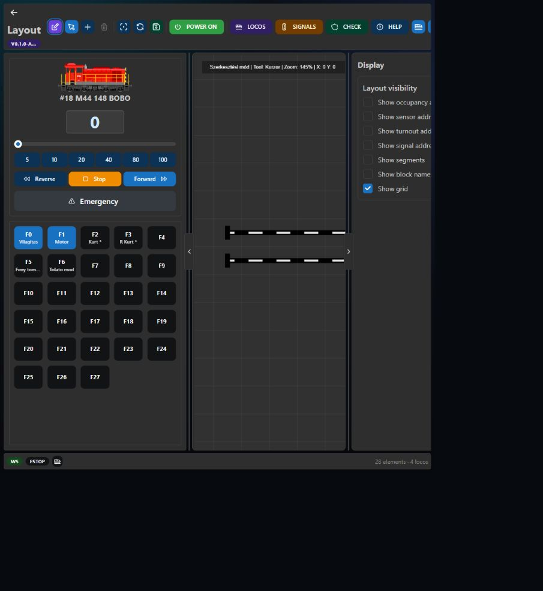

# Layout Editor

The Layout Editor fills the available browser window on desktop and tablet. Its canvas zoom and position are stored in browser local storage, so each computer or phone can keep its own preferred view.

## Toolbar

- **Edit** toggles between runtime and editing mode.
- **Pointer** selects an element.
- **Add** opens the element palette.
- **Delete** removes the selected element.
- **Fit** fits the complete layout in the canvas.
- **Reload** reloads the stored layout from the EX-CSB1.
- **Save** writes the layout to LittleFS.
- **POWER** controls MAIN track power.
- **LOCOS** opens the locomotive editor.
- **SIGNALS** opens automatic signal rules.
- **CHECK** validates the complete project.
- **HELP** opens this Wiki.

## Editing

1. Enable Edit mode.
2. Choose an element from **Add**.
3. Place it on the grid.
4. Select it and edit its properties in the right panel.
5. Press **R** to rotate the selected element.
6. Press **Escape** to cancel the current placement or selection action.
7. Save the layout.

Deleting an element can invalidate automation references. Run **CHECK** before finishing an editing session.

## Runtime mode

Runtime mode operates turnouts, signals, route buttons, sensors, and blocks without exposing editing controls. The right panel shows DCC-EX status and hardware devices. A second locomotive panel can replace it from the status bar.

