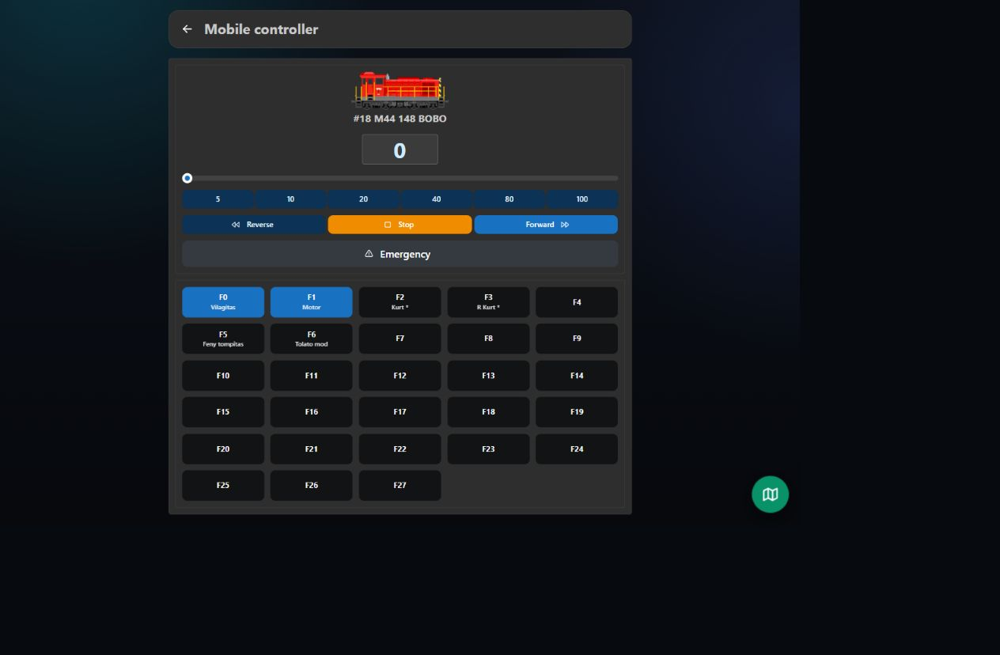
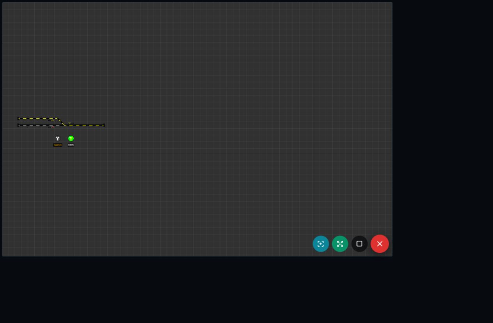

# Locomotives and mobile control

The locomotive editor stores each locomotive's stable ID, DCC address, name, maximum speed, image, functions, direction inversion, and optional actions.

## Driving

- Select a locomotive.
- Use the slider or preset speed buttons.
- Select Forward or Reverse.
- Use Stop for the selected locomotive.
- Use Emergency Stop for the complete command station.
- Function buttons F0–F27 support normal and momentary operation.

Direction inversion is applied server-side before DCC throttle commands are generated. Image mirroring is client-side and stored per browser, allowing phones on opposite sides of the layout to show the locomotive nose correctly for their viewpoint.

## Gamepad control

A Bluetooth or USB game controller can operate the locomotive selected in an open throttle panel. Button assignments, controller selection, defaults, and troubleshooting are described on the dedicated [Gamepad control](Gamepad-Control) page.

If both locomotive panels are visible in the Layout Editor, gamepad actions are received by both panels. Close the panel that must not receive gamepad commands, or use the single-panel Mobile Controller.

## Mobile layout overlay

The floating layout button opens a runtime-only track panel without editor or property panels.

The floating controls provide:

- Center view
- Fit view
- Emergency stop
- Close layout panel

Route buttons use the same progress overlay and emergency-stop behaviour as the desktop layout.

## Multi-client operation

Multiple browsers can be connected simultaneously. Locomotive, turnout, accessory, sensor, signal, power, and emergency states are broadcast through WebSocket updates. A lost WebSocket connection is shown in red and reconnects automatically.
