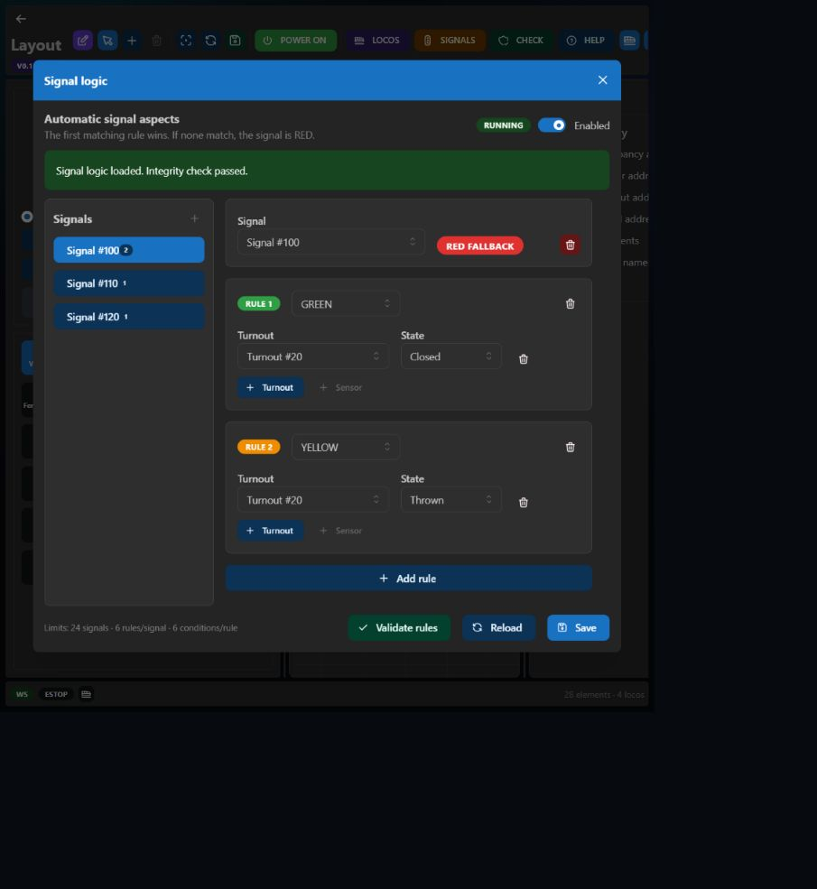

# Signals and automation

Signal Logic runs on the EX-CSB1, not in an open browser. Closing or refreshing the UI does not stop enabled automation.



## Signal element

A signal stores:

- starting linear accessory address;
- address length (normally 5 for DigiSignal);
- lamp/aspect count;
- bit values for GREEN, RED, YELLOW, and WHITE.

For a start address of `100`, length `5`, and bit value `10110`, the server writes the five physical outputs as consecutive accessory commands:

```text
<a 100 0>
<a 101 1>
<a 102 1>
<a 103 0>
<a 104 1>
```

One output is processed per firmware-loop pass. DCC-EX then queues real accessory packets on MAIN. The state is also cached and broadcast to browser clients.

## Rule evaluation

1. Rules are evaluated from top to bottom.
2. Every condition in a rule must match.
3. The **first matching rule wins**.
4. If no rule matches, the signal uses the safe **RED fallback**.

Conditions can reference:

- a turnout ID and its Closed/Thrown state;
- a sensor ID and its Active/Inactive state.

Signal, turnout, and sensor references are stored by stable layout element ID. Hardware addresses are resolved from the current layout when the firmware loads the rules. Changing an address does not require rewriting every rule.

## Output behaviour

- Outputs are sent when the desired aspect changes.
- Enabling/reloading the rules or restoring track power forces a fresh evaluation.
- Unchanged aspects are not transmitted continuously.
- With MAIN power off, no physical DCC signal reaches the decoder; power-on triggers re-evaluation.

## Limits

- 24 signal groups
- 6 rules per signal
- 6 conditions per rule
- 32 monitored sensor inputs
- 1–8 consecutive accessory outputs per signal

Use **Validate rules** before saving and the global **CHECK** command after layout editing.

